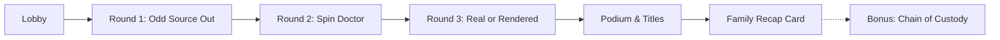

<div align="center">

# 🗣️ Pass It On
### *Spot the tricks. Share the clues. Play together.*

[](https://vitejs.dev/)
[](https://react.dev/)
[](https://tailwindcss.com/)
[](https://supabase.com/)
[](https://pass-it-on-three.vercel.app)

<br />

**A fast-paced, living-room party game about what your family shares—and what they pass on.**  
In ~12 minutes, a household or classroom learns to spot manipulation techniques without being lectured.

[🎮 **Play Live Demo**](https://pass-it-on-three.vercel.app) • [📖 **How to Play**](https://pass-it-on-three.vercel.app/how-to-play) • [✨ **Features**](#-features--design-philosophy) • [🛠️ **Setup & Installation**](#️-getting-started)

</div>

---

## 🌟 Overview

**Pass It On** is an asymmetric multiplayer web game designed for shared spaces—living rooms, classrooms, and community workshops. 

- **1 Host Screen:** Displayed on a TV, projector, or laptop, driving the game tempo and displaying news events, visual evidence, and live leaderboards.
- **2 to 8 Player Phones:** Players scan a QR code or enter a 4-letter room code on their mobile browsers to lock in answers, flag persuasive spin, and react in real-time.
- **Zero Friction:** No account creation, no app store downloads, and zero personal data stored.
- **Single-Screen Mode:** Fully playable with one laptop/projector where groups discuss and answer questions out loud.

---

## 🎯 Gameplay & Rounds

A game session consists of three fast-paced core rounds plus an optional bonus round:



### 🔍 Round 1: Odd Source Out
Four sources report the same news event with different credibility profiles (academic hedge, sensational blog, neutral journalism, or subtle satire).
- **Goal:** Identify the least reliable source for verifying the claim.
- **Mechanic:** 10-second timer with speed bonus tapering for rapid, accurate identification.

### 🎯 Round 2: Spin Doctor
A real-style headline is broken into distinct semantic phrases.
- **Goal:** Tap up to 3 phrases that perform emotional manipulation rather than factual reporting (loaded language, missing attribution, cherry-picked statistics, false balance).
- **Mechanic:** 15-second timer. Points are awarded for valid flags, with penalties for over-flagging (teaching that skepticism is not cynicism).

### 🖼️ Round 3: Real or Rendered
Five visual clues appear sequentially for 5 seconds each.
- **Goal:** Call out whether the image is authentic or AI-generated.
- **Mechanic:** Instant reveals identifying synthetic tells (hands, distorted background text, over-smoothed skin, semantic hallucinations).

### 🏆 Scoreboard & Archetype Titles
At the end of the match, players are awarded dynamic, performance-driven titles based on their specific gameplay metrics:
- 🦊 **The Skeptical Fox:** Highest Spin Doctor accuracy
- 🐆 **The Speedy Cheetah:** Fastest average answer time
- 🐼 **The Careful Panda:** Deliberate, high-accuracy decision making
- 🐢 **The Steady Turtle:** Most consistent cross-round scoring
- 🦁 **The Fact Lion:** Overall match winner

### 🔗 Bonus Round: Chain of Custody
Offered after the main match without altering core scores.
- **Goal:** Order 4 retellings of a claim chronologically to see how a simple study degraded into an all-caps outrage cycle.

### 📜 The Family Recap Card
Generates a downloadable, high-resolution PNG summarizing every manipulation technique encountered during the match with plain-language explanations.

---

## ✨ Features & Design Philosophy

- 🛡️ **Technique Recognition, Never Verdicts:** Focuses on teaching structural heuristics (attribution, emotional loading, synthetic media markers) rather than political or partisan policing.
- 🚫 **Anti-Misinformation Safeguards:** All synthetic media and fabricated demonstration headlines carry permanent, bold `FABRICATED EXAMPLE` visual watermarks.
- ♿ **Inclusive & Accessible:**
  - **Host Read-Aloud:** Shared screen text-to-speech so groups can listen together without phone audio interference.
  - **Gentle Feedback:** Soft sound cues instead of harsh buzzers, keeping players of all ages engaged.
  - **Reduced Motion:** Automatic adaptation for users who prefer minimal motion.
- 🎨 **Neo-Brutalist Playful Design:**
  - Warm cream background with tactile dot grids (`#FFF8ED`).
  - High-contrast ink outlines (`#1A1A1A`), bold typography (**Fredoka** + **Space Grotesk**), and hard drop shadows.
  - Symmetrical, custom-crafted brand lockup and vector icons.

---

## 🛠️ Tech Stack

- **Core:** [React 19](https://react.dev/), [Vite 8](https://vitejs.dev/), [React Router v7](https://reactrouter.com/)
- **Styling:** [Tailwind CSS v4](https://tailwindcss.com/), `@fontsource-variable/fredoka`, `@fontsource-variable/space-grotesk`
- **Realtime Networking:** [Supabase Realtime](https://supabase.com/docs/guides/realtime) (Broadcast WebSockets) with automatic local state fallback
- **Audio & Visuals:** [Howler.js](https://howlerjs.com/), [Canvas Confetti](https://www.kirilv.com/canvas-confetti/), [Phosphor Icons](https://phosphoricons.com/)
- **Utilities:** [html-to-image](https://github.com/bubkoo/html-to-image), [qrcode.react](https://github.com/zpao/qrcode.react)

---

## 📂 Project Structure

```text
pass-it-on/
├── public/                     # Static assets, brand SVGs, favicons
│   ├── brand/                  # Logo lockup, icons, social previews
│   └── favicon.svg
├── src/
│   ├── audio/                  # Audio engine, sound cues, host narration synthesis
│   ├── components/             # Reusable UI (BigButton, Card, TopRail, BrandMark, etc.)
│   ├── content/                # Game session content, manipulation techniques, profanity filters
│   ├── design/                 # Design tokens, color palette, typography definitions
│   ├── game/                   # Pure game reducer, state snapshotting, player titles, unit tests
│   ├── realtime/               # Supabase broadcast transport layer & reaction protocol
│   ├── screens/                # HostScreen, PlayerScreen, SoloScreen, LandingScreen, HowToPlay
│   ├── App.jsx                 # Application router and entry layout
│   ├── main.jsx                # React root mount
│   └── styles.css              # Custom utility classes, button compressions, dot grids
├── vercel.json                 # Vercel SPA routing configuration
├── package.json
└── vite.config.js
```

---

## 🚀 Getting Started

### Prerequisites
- **Node.js**: v18.0.0 or higher
- **npm** or **pnpm**

### 1. Clone the Repository
```bash
git clone https://github.com/Vurios/pass-it-on.git
cd pass-it-on
```

### 2. Install Dependencies
```bash
npm install
```

### 3. Configure Environment Variables (Optional)
For online multiplayer over separate networks, configure your Supabase project in `.env.local`:
```env
VITE_SUPABASE_URL=https://your-project.supabase.co
VITE_SUPABASE_ANON_KEY=your-anon-key
```
*(Note: If omitted, local in-memory fallback will handle single-machine / preview play).*

### 4. Run Development Server
```bash
npm run dev
```
Open [http://localhost:5173](http://localhost:5173) in your browser.

### 5. Run Test Suite
```bash
npm run test
```

### 6. Build for Production
```bash
npm run build
```

---

## 🚢 Deployment

The project is optimized for zero-config deployment on **Vercel**:

1. Push your latest code to GitHub.
2. Import the project in Vercel.
3. Add `VITE_SUPABASE_URL` and `VITE_SUPABASE_ANON_KEY` under **Settings > Environment Variables**.
4. Deploy!

Live production build: **[https://pass-it-on-three.vercel.app](https://pass-it-on-three.vercel.app)**

---

## 📄 License

MIT License. Free and open source for families, educators, and community workshops.
